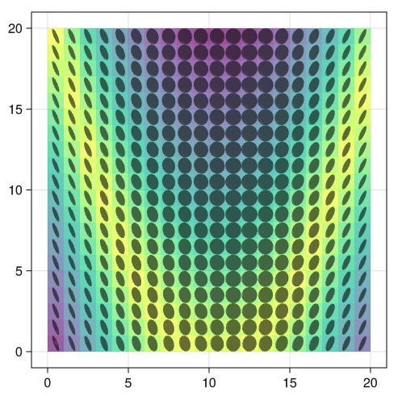
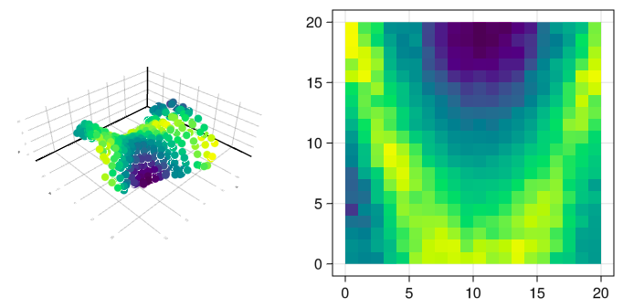

# LocalAnisotropies

[![Build Status][build-img]][build-url] [![Coverage][codecov-img]][codecov-url]


<p align="center">
  
</p>
<p align="center"><i>
  Local anisotropies ellipses extracted from reference data
</i></p>

## Introduction

This package deals with local anisotropies in geostatistics. It offers some solutions to extract them from a reference input. Then, it's possible to use the local anisotropies to create nonstationary spatial models, which can be used into estimation methods such as kriging. There are also some extra tools, like anisotropy interpolation and conversion to/between different rotation conventions. It is designed for 2-D and 3-D data and is developed to be used as an extension of [`GeoStats.jl`](https://github.com/JuliaEarth/GeoStats.jl) when dealing with nonstationarity of second order moments. A list of current implementations:

- <u>Local anisotropies extraction methods</u>:
  - Gradients
  - SVD / PCA <p>
- <u>Local anisotropies operations</u>:
  - Interpolation of directional data (via quaternions)
  - Import/export/convert to different conventions
  - Unconventional local variography using local anisotropies <p>
- <u>Nonstationary spatial methods</u>:
  - Moving windows
  - Kernel convolution
  - Spatial deformation <p>
- <u>Solvers adapted to these nonstationary spatial methods</u>:
  - Kriging

**Warning**: This package is still under (slow) development. Some of the implementations were not fully validated and may give inconsistent results. Debugging, contributions and suggestions are welcome.

## Installation

First, it is necessary to install Julia. Installation instructions for Windows, Linux and macOS are available [here](https://julialang.org/downloads/platform/).

To install the package: open the Julia REPL and then install the package with the following command. The `GeoStats.jl`, `Makie.jl` and `WGLMakie.jl` packages are installed together to run the usage example.

```julia
using Pkg; Pkg.add(["LocalAnisotropies","GeoStats","Makie","WGLMakie"])
```

## References

#### Introduction to local anisotropies extraction methods:
[Lillah & Boisvert (2015)](https://doi.org/10.1016/j.cageo.2015.05.015) Inference of locally varying anisotropy fields from diverse data sources

#### Introduction to nonstationary spatial methods:
[Sampson (2010)](https://doi.org/10.1201/9781420072884-13) Constructions for Nonstationary Spatial Processes

#### Moving windows:
[Haas (1990)](https://doi.org/10.1016/0960-1686(90)90508-K) Kriging and automated variogram modeling within a moving window <br>
[Stroet & Snepvangers (2005)](https://doi.org/10.1007/s11004-005-7310-y) Mapping curvilinear structures with local anisotropy kriging

#### Kernel convolution:
[Higdon (1998)](https://doi.org/10.1023/A:1009666805688) A process-convolution approach to modelling temperatures in the North Atlantic Ocean <br>
[Fouedjio et al. (2016)](https://doi.org/10.1016/j.spasta.2016.01.002) A generalized convolution model and estimation for non-stationary random functions

#### Spatial deformation:
[Sampson & Guttorp (1992)](https://doi.org/10.1080/01621459.1992.10475181) Nonparametric estimation of nonstationary spatial covariance structure <br>
[Boisvert (2010)](https://era.library.ualberta.ca/items/5acca59f-6e97-414d-ad13-34c8f97ce223) Geostatistics with locally varying anisotropy

## Documentation

The documentation of the main functions are available as [docstrings](https://juliahub.com/docs/LocalAnisotropies)
Check below an usage example that illustrate the package applications.

## Usage example

```julia
# load libraries for the example
using LocalAnisotropies
using GeoStats
using Random
import WGLMakie as Mke
Random.seed!(1234)

# create a reference scenario for tests
D = georef((P=[25-abs(0.2*i^2-j) for i in -10:9, j in 1:20],))
S = sample(D, UniformSampling(80, replace=false))
S = georef(values(S), PointSet(centroid.(domain(S))))
G = CartesianGrid(20,20)

# create an estimation problem
P = EstimationProblem(S, G, :P)

# plot reference scenario and samples extracted for further estimations
fig0 = Mke.Figure(size=(700, 350))
Mke.plot(fig0[1,1],D.geometry,color=D.P)
Mke.plot(fig0[1,2],G,showfacets=true,color=:white)
Mke.plot!(fig0[1,2],S.geometry,color=S.P,pointsize=10)
Mke.current_figure()
```

<p align="center">
  
</p>

```julia
# get local anisotropies using gradients of a 8x8 radius window
rawlpars = localanisotropies(Gradients, D, :P, 8)
Mke.plot(D.geometry, color=D.P, alpha=0.6)
Mke.plot!(rawlpars,D.geometry)
Mke.current_figure()
```

<p align="center">
  
</p>

```julia
# average 10 nearest local anisotropies
searcher = KNearestSearch(G, 10)
lpars = smoothpars(rawlpars, searcher)

# rescale magnitude of range2 to between 0.25 and 1.0
rescale_magnitude!(lpars, r2=(0.25,1.0))

# set possible reference axes to X and Y; ranges will be fixed in those directions
lparsx = reference_magnitude(lpars, :X)
lparsy = reference_magnitude(lpars, :Y)

Mke.plot(D.geometry, color=D.P, alpha=0.6)
Mke.plot!(lpars,D.geometry)
Mke.current_figure()
```

<p align="center">
  
</p>

```julia
# for custom visualizations, it's possible to export it to VTK
to_vtk("ellipses", D, lpars)
# below the file "ellipses.vtu" loaded in Paraview using TensorGlyph (disable extract eigenvalues)
```

<p align="center">
  
</p>

```julia
# pass local anisotropies to samples
spars = nnpars(lpars, D, S)

# do an unconventional variography along local X axis (same can be done for Y)
expvario = localvariography(S, spars, :P, tol=2, maxlag=20, nlags=20, axis=:X)
Mke.plot(expvario)
γx = ExponentialVariogram(sill=32., range=40.)
γy = GaussianVariogram(sill=32., range=8.)
Mke.plot!(γx)
Mke.current_figure()
```

<p align="center">
  
</p>

```julia
# kriging using moving windows method
MW = LocalKriging(:P => (variogram=γx, localaniso=lparsx, method=:MovingWindows))
s1 = solve(P, MW)
Mke.plot(s1.geometry,color=s1.P)
```

<p align="center">
  
</p>

```julia
# kriging using kernel convolution method (smaller search; unstable with many local variations)
KC = LocalKriging(:P => (variogram=γy, localaniso=lparsy, method=:KernelConvolution, maxneighbors=6))
s2 = solve(P, KC)
Mke.plot(s2.geometry,color=s2.P)
```

<p align="center">
  
</p>

```julia
# deform space using kernel variogram as dissimilarity input
Sd1, Dd1 = deformspace(S, G, lparsx, KernelVariogram, γx, anchors=1500)
Pd1 = EstimationProblem(Sd1, Dd1, :P)
γ1 = GaussianVariogram(sill=21.3, range=22.5)
s3 = solve(Pd1, KrigingSolver(:P => (variogram=γ1,)))

# plot
fig3 = Mke.Figure(size=(700, 350))
Mke.plot(fig3[1,1],to_3d(s3).geometry,color=s3.P)
Mke.plot(fig3[1,2],G,color=s3.P)
Mke.current_figure()
```

<p align="center">
  
</p>

```julia
# deform space based on a graph built with average anisotropic distances
# of the ten nearest data; do variography in multidimensional space
LDa = graph(S, G, lparsx, AnisoDistance, searcher)
Sd2, Dd2 = deformspace(LDa, GraphDistance, anchors=1500)
γ2 = GaussianVariogram(sill=22., range=22.)

# traditional kriging in the new multidimensional space
Pd2 = EstimationProblem(Sd2, Dd2, :P)
s4 = solve(Pd2, KrigingSolver(:P => (variogram=γ2,)))

# plot
fig4 = Mke.Figure(size=(700, 350))
Mke.plot(fig4[1,1],to_3d(s4).geometry,color=s4.P)
Mke.plot(fig4[1,2],G,color=s4.P)
Mke.current_figure()
```

<p align="center">
  
</p>

```julia
# deform space based on a graph built with kernel variogram of the ten
# nearest data; do variography in multidimensional space
LDv = graph(S, G, lparsy, KernelVariogram, γy, searcher)
Sd3, Dd3 = deformspace(LDv, GraphDistance, anchors=1500)
γ3 = NuggetEffect(1.0) + GaussianVariogram(sill=21., range=22.)

# traditional kriging in the new multidimensional space
Pd3 = EstimationProblem(Sd3, Dd3, :P)
s5 = solve(Pd3, KrigingSolver(:P => (variogram=γ3,)))

# plot
fig5 = Mke.Figure(size=(700, 350))
Mke.plot(fig5[1,1],to_3d(s5).geometry,color=s5.P)
Mke.plot(fig5[1,2],G,color=s5.P)
Mke.current_figure()
```

<p align="center">
  
</p>

```julia
γomni = GaussianVariogram(sill=32., range=11.)
OK = KrigingSolver(:P => (variogram=γomni, maxneighbors=20))
s0 = solve(P, OK)
Mke.plot(s0.geometry,color=s0.P)
```

<p align="center">
  
</p>

```julia
# comparison of the different estimates
mse(a,b) = sum((a .- b) .^ 2)/length(b)
solvers = ["OK","MW","KC","SD1","SD2","SD3"]
errors  = [mse(getproperty(x,:P),getproperty(D,:P)) for x in [s0,s1,s2,s3,s4,s5]]
Mke.barplot(1:6,errors,axis=(xticks=(1:6,solvers),ylabel="Mean squared error",xlabel="Estimation method"))
```

<p align="center">
  
</p>

Some extra tools to work with local anisotropies:

```julia
# import external local anisotropies in GSLIB convention
dummy = georef((az=1:10, r1=1:10, r2=1:10), PointSet(rand(2,10)))
pars  = localanisotropies(dummy, [:az], [:r1,:r2], :GSLIB)

# interpolate local anisotropies into a coarser grid
G_ = CartesianGrid((10,10),(0.5,0.5),(2.0,2.0))
lpars_ = idwpars(lpars, searcher, G_, power=2.0)

# convert between different rotation conventions
angs1 = convertangles([30,30,30], :GSLIB, :Datamine)
angs2 = convertangles.(pars.rotation, :GSLIB)
```


[build-img]: https://img.shields.io/github/actions/workflow/status/rmcaixeta/LocalAnisotropies.jl/CI.yml?branch=master
[build-url]: https://github.com/rmcaixeta/LocalAnisotropies.jl/actions

[codecov-img]: https://codecov.io/gh/rmcaixeta/LocalAnisotropies.jl/branch/master/graph/badge.svg
[codecov-url]: https://codecov.io/gh/rmcaixeta/LocalAnisotropies.jl
