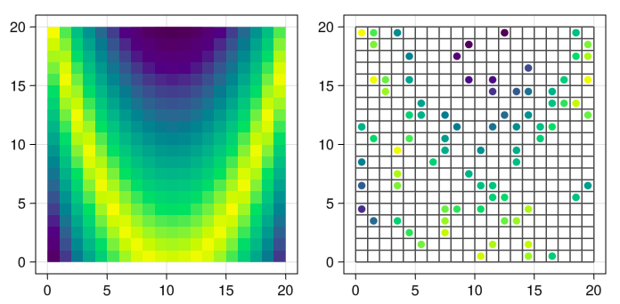
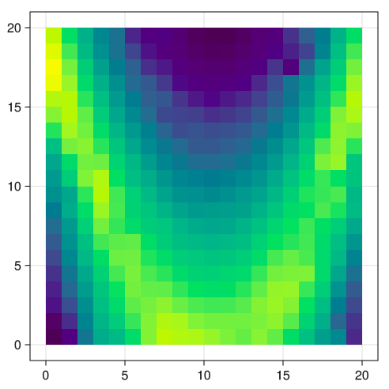
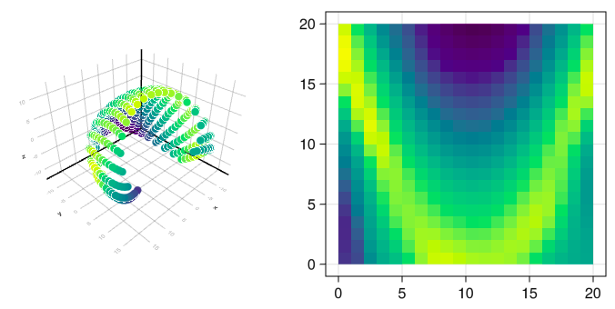
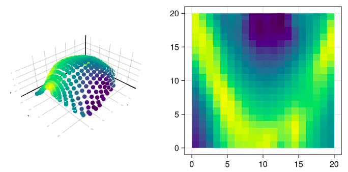

# LocalAnisotropies

[![Build Status][build-img]][build-url] [![Coverage][codecov-img]][codecov-url]

`LocalAnisotropies.jl` is a implementation of geostatistics methods to deal with the non-stationarity of second order moments (aka locally varying anisotropies). It is developed to be used as an extension of [`GeoStats.jl`](https://github.com/JuliaEarth/GeoStats.jl).

**Warning**: This package is still under (slow) development. Some of the implementations were not fully validated and may give inconsistent results.

## Introduction

This package offer some solutions to extract local parameters from a reference input, model non-stationary covariance models, and adapt estimation methods to be used with them. Designed for 2-D and 3-D data. There are some extra tools, like local parameters interpolation and conversion to/between different rotation conventions. A list of current implementations:

- <u>Local parameters extraction methods</u>:
  - Gradients
  - SVD / PCA <p>
- <u>Nonstationary spatial methods</u>:
  - Moving windows
  - Kernel convolution
  - Spatial deformation <p>
- <u>Estimation methods adapted to them</u>:
  - Kriging

## Installation

First, it is necessary to install Julia. Installation instructions for Windows, Linux and macOS are available [here](https://julialang.org/downloads/platform/).

`LocalAnisotropies.jl` is not released yet. To use it: open the Julia REPL and then run the following command.

```julia
using Pkg; Pkg.develop(url="https://github.com/rmcaixeta/LocalAnisotropies.jl"); Pkg.add("GeoStats")
```

## Documentation

The documentation of the main functions are available as docstrings.
Check below an usage example that illustrate the package applications.

## References

#### Introduction to local parameters extraction methods:
[Lillah & Boisvert (2015)](https://doi.org/10.1016/j.cageo.2015.05.015) Inference of locally varying anisotropy fields from diverse data sources

#### Introduction to nonstationary spatial methods:
[Sampson (2010)](https://doi.org/10.1201/9781420072884-13) Constructions for Nonstationary Spatial Processes

#### Moving windows:
[Haas (1990)](https://doi.org/10.1016/0960-1686(90)90508-K) Kriging and automated variogram modeling within a moving window <br>
[Stroet & Snepvangers (2005)](https://doi.org/10.1007/s11004-005-7310-y) Mapping curvilinear structures with local anisotropy kriging

#### Kernel convolution:
[Higdon (1998)](https://doi.org/10.1023/A:1009666805688) A process-convolution approach to modelling temperatures in the North Atlantic Ocean <br>
[Fouedjio et al. (2016)](https://doi.org/10.1016/j.spasta.2016.01.002) A generalized convolution model and estimation for non-stationary random functions

#### Spatial deformation:
[Sampson & Guttorp (1992)](https://doi.org/10.1080/01621459.1992.10475181) Nonparametric estimation of nonstationary spatial covariance structure <br>
[Boisvert (2010)](https://era.library.ualberta.ca/items/5acca59f-6e97-414d-ad13-34c8f97ce223) Geostatistics with locally varying anisotropy

## Usage example

```julia
using LocalAnisotropies
using GeoStats
using Plots
using Random
Random.seed!(1234)

# reference scenario for tests
D = georef((P=[25-abs(0.2*i^2-j) for i in -10:9, j in 1:20],))
S = sample(D, 80, replace=false)
G = CartesianGrid(20,20)

# Estimation problem
P = EstimationProblem(S, G, :P)
γ = GaussianVariogram(sill=35., range=11.)

searcher = KNearestSearch(G, 10)

splot = plot(G)
splot = plot!(S)
plot(plot(D),splot)
```

<p align="center">
  
</p>

```julia
# get local parameters
rawlpars = localparameters(Gradients(), D, :P, 8)
plot(D, alpha=0.6, colorbar=false)
plot!(rawlpars,D)
```

<p align="center">
  
</p>

```julia
# rescale magnitude and average 10 nearest local parameters
lpars = rescale_magnitude(rawlpars, (0.5,1.0))
lpars = smoothpars(lpars, searcher)
plot(D, alpha=0.6, colorbar=false)
plot!(lpars,D)
```

<p align="center">
  
</p>

```julia
# plot(lpars, spatialobj) will only work for 2D data
# for 3D or custom visualizations, it's possivle to export it to VTK
localpars2vtk("ellipses", D, lpars)
# below the file "ellipses.vtu" loaded in Paraview using TensorGlyph
```

<p align="center">
  
</p>

```julia
# LocalKriging (MW)
MW = LocalKriging(:P => (variogram=(:X=>γ), localpars=lpars, method=:MovingWindows))
s1 = solve(P, MW)
plot(s1,[:P])
```

<p align="center">
  
</p>

```julia
# LocalKriging (KC)
KC = LocalKriging(:P => (variogram=(:X=>γ), localpars=lpars, method=:KernelConvolution))
s2 = solve(P, KC)
plot(s2,[:P])
```

<p align="center">
  
</p>

```julia
# Spatial deformation: anisotropic variogram distances
Sd1, Dd1 = deformspace(S, G, lpars, LocalVariogram(), γ, anchors=1500)
Pd1 = EstimationProblem(Sd1, Dd1, :P)
γ1 = GaussianVariogram(sill=35., range=40.)
s3 = solve(Pd1, Kriging(:P => (variogram=γ1,)))
plot(plot(to3d(s3),[:P]), plot(georef(values(s3),G),[:P],colorbar=false))
```

<p align="center">
  
</p>

```julia
# Spatial deformation: geodesic anisotropic distances
LDa = graph(S, G, lpars, LocalAnisotropy(), searcher)
Sd2, Dd2 = deformspace(LDa, GraphDistance(), anchors=1500)
Pd2 = EstimationProblem(Sd2, Dd2, :P)
γ2 = GaussianVariogram(sill=35., range=40.)
s4 = solve(Pd2, Kriging(:P => (variogram=γ2,)))
plot(plot(to3d(s4),[:P]), plot(georef(values(s4),G),[:P],colorbar=false))
```

<p align="center">
  
</p>

```julia
# Spatial deformation: geodesic anisotropic variogram distances
LDv = graph(S, G, lpars, LocalVariogram(), γ, searcher)
Sd3, Dd3 = deformspace(LDv, GraphDistance(), anchors=1500)
Pd3 = EstimationProblem(Sd3, Dd3, :P)
γ3 = GaussianVariogram(sill=45., range=40.)
s5 = solve(Pd3, Kriging(:P => (variogram=γ3,)))
plot(plot(to3d(s5),[:P]), plot(georef(values(s5),G),[:P],colorbar=false))
```

<p align="center">
  
</p>

```julia
# Ordinary kriging for comparison
OK = Kriging(:P => (variogram=γ, maxneighbors=20))
s0 = solve(P, OK)
plot(s0,[:P])
```

<p align="center">
  
</p>

```julia
# comparison of the different estimates
mse(a,b) = sum((a .- b) .^ 2)/length(b)
solvers = ["OK","MW","KC","SD1","SD2","SD3"]
errors  = [mse(x[:P],D[:P]) for x in [s0,s1,s2,s3,s4,s5]]
bar(solvers,errors,legend=false,ylabel="Mean squared error",xlabel="Estimation method")
```

<p align="center">
  
</p>

Some extra tools to work with local parameters:

```julia
# import external local parameters in GSLIB convention
dummy = georef((az=1:10, r1=1:10, r2=1:10), PointSet(rand(2,10)))
pars  = localparameters(dummy, [:az], [:r1,:r2], :GSLIB)

# interpolate local parameters into a coarser grid
G_ = CartesianGrid((10,10),(0.5,0.5),(2.0,2.0))
lpars_ = idwpars(lpars, searcher, G_, power=2.0)

# convert between different rotation conventions
angs1 = convertangles([30,30,30], :GSLIB, :Datamine)
angs2 = convertangles.(pars.rotation, :GSLIB)
```


[build-img]: https://img.shields.io/github/workflow/status/rmcaixeta/LocalAnisotropies.jl/CI?style=flat-square
[build-url]: https://github.com/rmcaixeta/LocalAnisotropies.jl/actions

[codecov-img]: https://codecov.io/gh/rmcaixeta/LocalAnisotropies.jl/branch/master/graph/badge.svg
[codecov-url]: https://codecov.io/gh/rmcaixeta/LocalAnisotropies.jl
